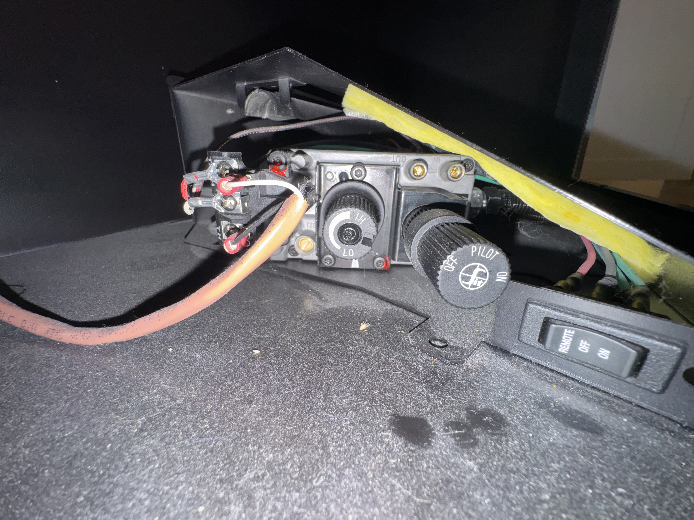
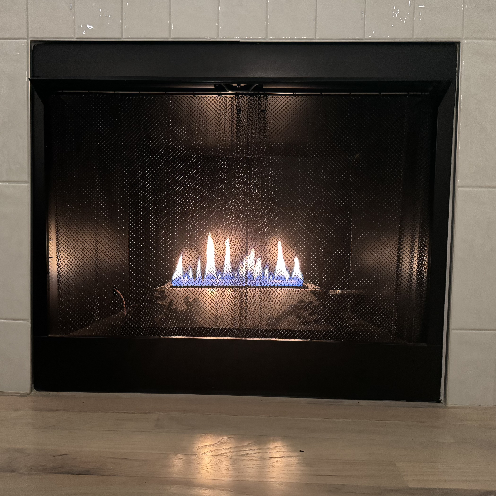

# Fireplace

## System Type

- **Empire VFRL24 vent‑free gas fireplace**
- **Standing pilot** with **millivolt gas valve**
- Operates **without household electricity**

## Parts

- Firebox, in the fireplace.
- Main gas valve with key, to the right of the fireplace.
- Wall switch, to the right of the fireplace.

## Main Gas Valve

- Counterclockwise = **OPEN**
- Clockwise = **CLOSED**
- Closing this shuts off *all* gas to the unit
- 

## Firebox

The firebox has controls on the left and right. Inside, it has a pilot on the center
right, and a main burner running the width of the firebox, with holes opening through the
main cover slit.

Controls on the left-hand side:

- Rocker switch
  - **OFF** → wall switch controls burner
  - **ON** or **REMOTE** → burner forced ON (bypasses wall switch)
- Control knob:
  - **OFF** – no gas, pilot out
  - **PILOT** – pilot gas available *only when knob is pressed in*
  - **ON** – main burner enabled (requires switch call)
- Flame-height knob: **Low** continuous to **High**, affects main burner.
- 

Controls on the right-hand side:

- Pilot ignition button.

## Normal Use

The normal use is to have the pilot lit and the rocker switch set to **Off**, in which
case the wall switch controls the main-burner flame.

- 

## Start of season

1. Open the main gas valve.
1. Set fireplace control knob to **PILOT**
1. **Press and hold the control knob fully in**
1. While holding it in, **press the igniter button repeatedly**
1. Observe pilot flame (steady blue, a couple inches long)
1. Release knob
1. Confirm pilot **stays lit**

The first light after long downtime may require extra time due to air in the line.

## End of season

1. Wall switch **OFF**
1. Control knob to **OFF** (pilot out)
1. Close main gas valve.

## Pilot assembly

To access the pilot (not needed for lighting), remove the three screws at the front base
of the cover, and lift up the cover. The assembly is on the right-hand side.

- **Vertical white ceramic stick** → spark electrode
- **Vertical stick with red base** → thermocouple / thermopile (safety sensor)
- **Lower horizontal metal rod** → **pilot burner** (gas exits at its tip)
- **Upper horizontal tube** → main burner feed (not pilot)
- There is **no separate “pilot hood” cap** on this design
- The **pilot flame exits directly from the tip of the lower horizontal rod**
- The igniter spark occurs **at that same location**
- 
